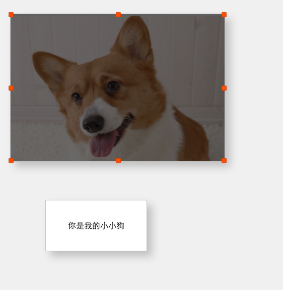
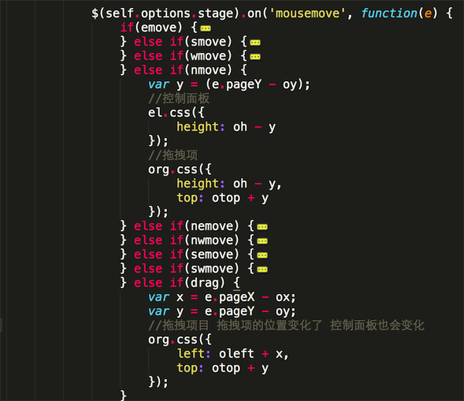

# div拖拽缩放jquery插件编写————带8个控制点
> 项目中需要对div进行拖拽缩放，需要有控制面板8个控制点的那种，原以为这么常见的效果应该能搜索到很多相关插件，然而可以完成拖拽的实繁，却找不到我想要的，还是自己动手丰衣足食吧
> [效果预览（只支持pc端）](https://zengwenfu.github.io/z-resize/test.html)

## 思路

### 一、舞台拖拽项定义

拖拽以及缩放需要有一个范围，姑且管这个叫舞台（stage）。另外，在舞台范围内，如何以一种简单的方式定义拖拽项？可以通过给div增加一个拖拽class（例如：resize-item），拖拽项应该是absolute布局，舞台是relative/absolute布局

所以拖拽类需要有如下两个参数
```
    /**
     * 默认参数
     */
    var defaultOpts = {
        stage: document, //舞台,默认为stage
        itemClass: 'resize-item', //可缩放的类名
    };

    /**
     * 定义类
     */
    var ZResize = function(options) {
        this.options = $.extend({}, defaultOpts, options);
        this.init();
    }
```

### 二、生成控制面板

1. 面板：为了尽可能少的影响到拖拽项，就不直接在拖拽项上生成控制点，而是为拖拽项增加一个半透明层作为控制面板，控制面板尺寸位置和拖拽项一致，将控制面板插入拖拽项（由于都是absolute布局，不影响原内容），可以更好的控制位置和一一对应
```
    var width = $(this).width();
    var height = $(this).height();
    var resizePanel = $('<div class"resize-panel"></div>');
    resizePanel.css({
        width: width,
        height: height,
        top: 0,
        left: 0,
        position: 'absolute',
        'background-color': 'rgba(0,0,0,0.5)',
        cursor: 'move',
        display: 'none'
    });
    self.appendHandler(resizePanel, $(this));
```
2. 控制点：为控制面板增加东、南、西、北、东北、西北、西南、东南控制点，为每个控制点设置对应的cursor
```
    'cursor': 'n-resize' //北
    'cursor': 's-resize' //南
    'cursor': 'e-resize' //东
    'cursor': 'w-resize' //西
    'cursor': 'ne-resize' //东北
    'cursor': 'nw-resize' //西北
    'cursor': 'se-resize' //东南
    'cursor': 'sw-resize' //西南
```
### 三、缩放

1. 每个控制点影响的属性不一样
```
    北（上）：
        高度（height） 
        位置y(拖拽上边，应该保持下边固定，所以高度变化之后位置也要变化)
    南（下）：
        高度（height）
    东（右）：
        宽度（width）
    西（左）：
        宽度（width）
        位置x(拖拽左边，应该保持右边固定，所以宽度变化之后位置也要变化)

    东北、西北、东南、西南  以上两两结合
```

2. 监听控制点mousedown，分别定义一个标志，并且记录下原始位置，如：
```
    //西
    var wmove = false;
    el.on('mousedown','.w', function(e) {
        ox = e.pageX;//原始x位置
        ow = el.width();
        oleft = parseInt(org.css('left').replace('px', ''));
        wmove = true;
    });
```
3. 监听控制面板的mousedown，同样定义一个标志，用于拖动（drag）
4. 监听舞台（stage）的mousemove（注意这里不是监听控制点的mousemove，因为控制点实在是太小，无法灵敏的拖动），判断各个控制点以及控制面板mousedown的标志分别对宽高和位置进行处理。处理的逻辑为：touchmove过程中的`e.pageX/e.pageY - ox/oy(原始) = 偏移量`，对于第一点中提到的每个控制点影响的属性，根据偏移量进行变化

5. 监听舞台（stage）的mouseup事件（这里同样不能是控制点的mouseup），把所有的mousedown标志重置为false

> pc端的mouse事件不同于手机端的touch事件，touchstart->touchmove->touchend触发有顺序性，mouse事件没有顺序性，未触发mousedown也能触发mousemove，所以需要设置标志来判断

### 四、控制面板的出现隐藏

控制面板初始化的时候，应该是隐藏的，只有点击对应的拖拽项的时候才出现，并且点击舞台空白部分，需要隐藏控制面板（组织事件冒泡）
```
    /**
     +  点击item显示拖拽面板
     */
    bindTrigger: function(el) {
        var self = this;
        el.on('click', function(e) {
            //组织事件冒泡，不然会被舞台触发，舞台触发会把控制面板隐藏掉
            e.stopPropagation();
            self.triggerResize(el);
        });
    },
    /**
     +  点击舞台空闲区域 隐藏缩放面板
     */
    bindHidePanel: function(el) {
        var stage = this.options.stage;
        var itemClass = this.options.itemClass;
        $(stage).bind('click', function() {
            $('.' + itemClass).children('div').css({
                display: 'none'
            });
        })
    }
```


